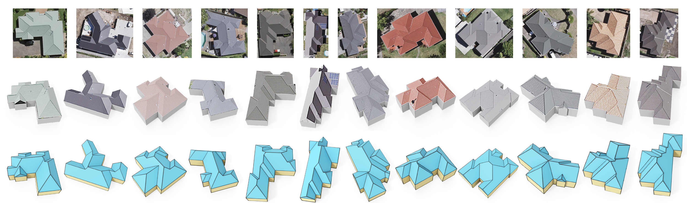

# Intuitive and Efficient Roof Modeling for Reconstruction and Synthesis

This is an example code for the paper "Intuitive and Efficient Roof Modeling for Reconstruction and Synthesis",
by [Jing Ren](https://ren-jing.com/), [Biao Zhang](http://1zb.github.io/), [Bojian Wu](https://bojianwu.github.io/), 
[Jianqiang Huang](https://scholar.google.com.hk/citations?user=UqAybqgAAAAJ&hl=en),
[Lubin Fan](https://lubinfan.github.io/index.html),
[Maks Ovsjanikov](http://www.lix.polytechnique.fr/~maks/),
and [Peter Wonka](http://peterwonka.net/).

In this project, we propose a novel and flexible roof modeling approach that can be used for constructing planar 3D polygon roof meshes. 
Our method uses a *graph* structure to encode roof topology and enforces the roof validity by optimizing a simple *planarity metric* we propose.
We showcase two applications: (1) an interactive roof editing framework that can be used for roof design or roof reconstruction from aerial images.
(2) a generative model to synthesize new roof meshes from scratch.

You can find more details at: [[paper]](), [[suppl. mat]](), [[suppl. video]](), [[slides]](), [[presentation video]]().

## Main Components
- [UIs for Image Annotation](https://github.com/llorz/SGA21_roofOptimization/tree/main/UI_annotation): We provide two web-based UIs, which can be used for specifying roof topology in the uploaded images/drawings.

- [Roof Optimization](https://github.com/llorz/SGA21_roofOptimization/tree/main/RoofOptimization): From the input (or automatically generated) roof graph, we optimize for a *valid 3D embedding* of the roof such that each 3D roof face is *planar*. In this step we can also incorporate different regularizers or aesthetic constraints into the optimization formulation. 

- [Roof Dataset](https://github.com/llorz/SGA21_roofOptimization/tree/main/RoofGraphDataset): We created a building-image paired dataset that contains more than 3K samples using our roof modeling tools. 

- [Application 01 - Roof Interactive Editing](https://github.com/llorz/SGA21_roofOptimization/tree/main/UI_editing): Our optimization-based roof modeling formulation is compatible with different edits, including moving edges/vertices, snapping an edge, merging faces etc. 

- [Application 02 - Roof Synthesis from Scratch](https://github.com/llorz/SGA21_roofOptimization/tree/main/RoofSynthesis): We also propose a generative model for roof synthesis from scratch.

## Comments
- Please let us know (jing.ren@kaust.edu.sa, biao.zhang@kaust.edu.sa) if you have any question regarding the algorithms/paper or you find any bugs in the code ԅ(¯﹃¯ԅ)
- This work is licensed under a [Creative Commons Attribution-NonCommercial 4.0 International License](http://creativecommons.org/licenses/by-nc/4.0/). For any commercial uses or derivatives, please contact us (jing.ren@kaust.edu.sa, peter.wonka@kaust.edu.sa, maks@lix.polytechnique.fr). 
