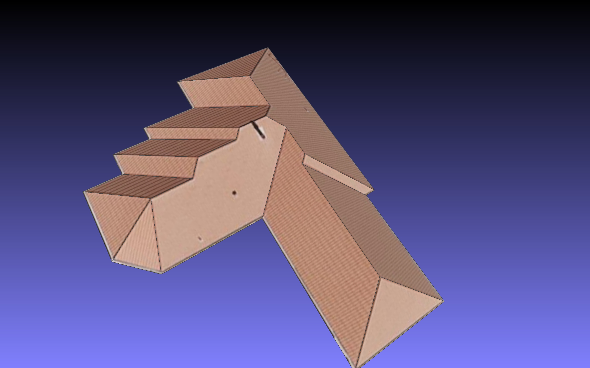

# Roof-Image Dataset

<p align="center">
  
</p>

- ```dt_roof_image/```: aerial images that contain planar roofs
- ```dt_roof_label/```: the user annotations of the roof topology on the corresponding aerial images. 
  - For each roof, we store the ```roofname.verts``` and ```roofname.faces```
  - ```roofname.verts``` stores the 2D vertex positions of the roof vertices on the image (```dt_roof_image/roofname.jpg```)
  - ```roofname.faces``` stores the roof faces in row-wise, i.e., each row is a set of vertexIDs (0-based index)
  - These annotations can be noisy. For example, there exist duplicated vertices/faces, visually parallel outline edges are not parallel to each other during the annotation etc. 
- ```res_roof_graph/```: we first clean the input annotations a bit, then run our roof optimization algorithm to obtain *valid* roof graphs. 
I.e., assigning z-axis values only to the roof vertices can lead to *valid* 3D roof embeddings. 
- ```res_building/```: we construct a building from the optimized roof graph with roof height 70 and body height 75
- ```res_obj/```: for each roof, we created ```roofname.obj``` (a building that aligns with the input image), and ```roofname_roof.obj``` (a rooftop mesh that is textured by the aerial image)
  - Note: make sure that ```res_obj/``` and ```dt_roof_image/``` are in the same directory.  
  - You can visualize these roof meshes in [MeshLab](https://www.meshlab.net/) directly:
  
<p align="center">
  
  
</p>
  
## Comments
- ```main.m```: shows how to load and visualize a roof graph and a .polyshape we saved
- ```eg_construct_building.m```: shows how to construct a building from the optimized roof graph with input roof height and body height
