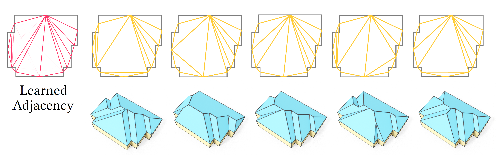

# Roof Optimization
In this project, we propose a novel and flexible *roof modeling* approach that can be used for constructing planar 3D polygon roof meshes. 
Our method uses a *roof graph* structure to encode roof topology and enforces the roof validity by optimization a simple but effective *planarity metric*. 

## Main functions
1. **Roof graph specification**: one can use the UIs [here](https://github.com/llorz/SGA21_roofOptimization/tree/main/UI_annotation) to specify the roof topology as a primal graph (consisting roof vertices ```V``` and faces ```F```), or a dual graph (consisting roof outline vertices ```VO```, and face adjacency matrix ```A```). See ```RoofOptimization/utils/func_IO_plot/``` for functions to load and visualize roof graphs.
2. **Roof optimization**: we then solve for a *valid 3D embedding* for the roof, such that each 3D roof face is planar. See the [function](https://github.com/llorz/SGA21_roofOptimization/blob/main/RoofOptimization/fig16_recon/reconstruct_3D_roof.m) ```RoofOptimization/fig16_recon/reconstruct_3D_roof.m```, in which the function ```energy_smallest_eigenval(X, F)``` gives a *planarity* metric. 
3. [Blender](https://www.blender.org/) is used to convert the reconstructed polygonal roof (saved as ```.polyshape```) into ```.obj``` file. See ```/RoofOptimization/utils/func_python/matlab_process_roof_polyshape(_windows).m```. To make it work, you might need to update the blender and project path in ```/RoofOptimization/utils/func_python/blender_path(_win).txt```

## Experiments
### Roof Reconstruction from Aerial Images
<p align="center">
  
</p>

- You can run ```RoofOptimization/fig16_recon/fig16_recon.m``` to reproduce the Fig.16 in the paper
- (a) shows a set of aerial images containing roofs with different complexity. (b) shows our reconstructed roofs textured by the input image. (c) shows the topology of our reconstructed roofs.

### Roof Optimization with Differenct Constraints or Regularizers
Our *optimization-based* roof modeling technique is flexible and can be adapted easily to different settings such as adopting user specified regularizers. For example, in the default setting as discussed in Sec. 4, we assume the roof outline is fixed (similar to the straight skeleton based methods), and we only optimize the positions of the roof vertices for a valid 3D roof, which is achieved by minimizing the planarity metric as defined in Eq.(1). In practice, one can set the outline vertices as free variables as well for optimization, and one can also include different regularizers during the roof optimization. For example:
1. In Fig. 11, we set some of the roof outline vertices (highlighted in red) as free variables. See ```RoofOptimization/fig11_outlineDiffHeight/fig11_diffHeight.m```
<p align="center">
  
</p>


2. In Fig. 4, we show some Asian buildings created by our method. See ```RoofOptimization/fig4_fig14_AsianBuildings/```.
<p align="center">
  
</p>

- To make roof embeddings more realistic, we add an extra energy term to regularize the *variance* of the height of some vertices, such as all the roof vertices in the Hakka Tulou example, and different groups of outline vertices in the Hexagonal Pavilion example. 
- The Temple example shows that our formulation can handle the case with vertical facades/planes inside the roof.
- The Nagoya Castle example shows that our formulation can also handle the case with holes/inner courtyards inside the building.

### Miscellaneous
1. In Fig. 3, we show that our formulation can handle the case where there exists a face that contains multiple outline edges, while straight skeleton based methods cannot.  See ```RoofOptimization/fig3_fig15_faceWithMultiOutlineEdges```. Note that, using the primal graph to encode roof topology can handle this case directly. In Fig. 15 we particually discuss how to use the dual graph to handle this case. 
<p align="center">
  
</p>

2. ```RoofOptimization/fig7_fig13_spectral2DIni/``` gives an example of how to compute a *spectral 2D embedding* for an abstract roof graph as discussed in Sec.4.3 and Fig. 13.

3. ```RoofOptimization/fig23_learnedAdj/``` gives an example of extracting multiple valid dual graph from the predicted roof face adjacencies (Fig. 23).
<p align="center">
  
</p>

## Baseline methods
### Straight Skeleton based methods:
- Straight Skeleton in CGAL [[code]](https://doc.cgal.org/latest/Straight_skeleton_2/index.html)
- Weighted Straight Skeleton in Java [[code]](https://github.com/twak/campskeleton)
### Commercial software
- [3ds Max](https://www.autodesk.ae/products/3ds-max/overview)
- [SketchUp](https://www.sketchup.com/)


## References
1. "A Novel Type of Skeleton for Polygons", *Oswin Aichholzer, Franz Aurenhammer, David Alberts, Bernd Gartner*, 1996. [[paper]](https://www.researchgate.net/publication/220349949_A_Novel_Type_of_Skeleton_for_Polygons)
2. "Straight Skeleton Implementation", *Petr Felkel and Stepan Obdrzalek*, 1998. [[paper]](http://www.dma.fi.upm.es/personal/mabellanas/tfcs/skeleton/html/documentacion/Straight%20Skeletons%20Implementation.pdf)
3. "Computing Straight Skeletons and Motocycle Graphs: Theory and Practice", *Stefan Huber*, 2011. [[PhD thesis]](https://www.sthu.org/research/publications/files/phdthesis.pdf)
4. "Interactive Architectural Modeling with Procedural Extrusions", *Tom Kelly and Peter Wonka*, 2011. [[paper]](http://www.twak.co.uk/2011/04/interactive-architectural-modeling-with.html)
