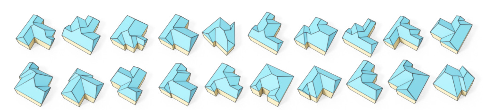
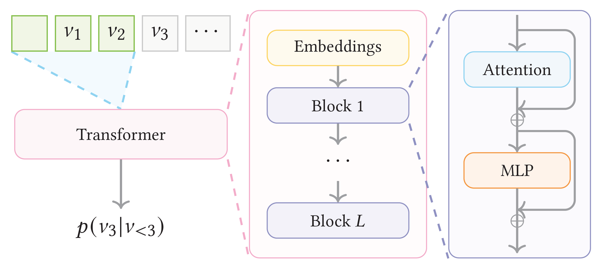
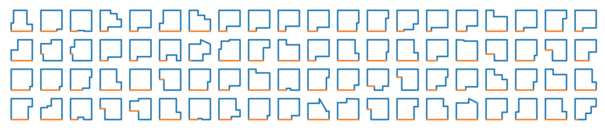
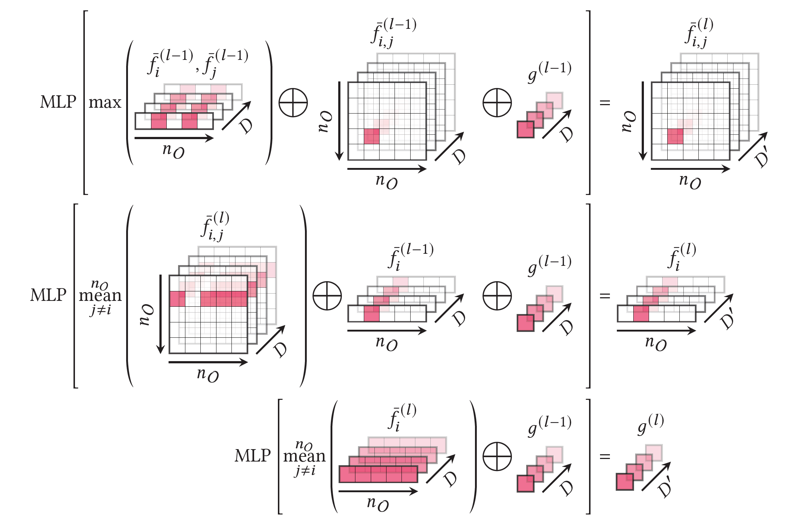

# Roof Synthesis from Scratch (under construction)

  

We propose a roof synthesis method based on our roof modeling formulation, which can generate 3D planar roofs (buildings) from scratch, as shown in the above image. Our solution consists of two main steps: (1) first generate a roof outline (a sequence of 2D vertex positions) using a transformer (2) predict the face adjacencies to form a dual roof graph. Once we get the dual graph of a roof, we can run our roof optimization to obtain a planar 3D roof. 

## Step 1: roof outline generation

  

- We use a transformer (as shown above) to automatically generate a roof outline
- ...
- ...
- Here we show some examples of automatically generated roof outlines:

  

## Step 2: face adjacency prediction

  

- We use GCNs for face adjacency prediction (we show the building block of our GCNs in the above image)
- ...
- ...

