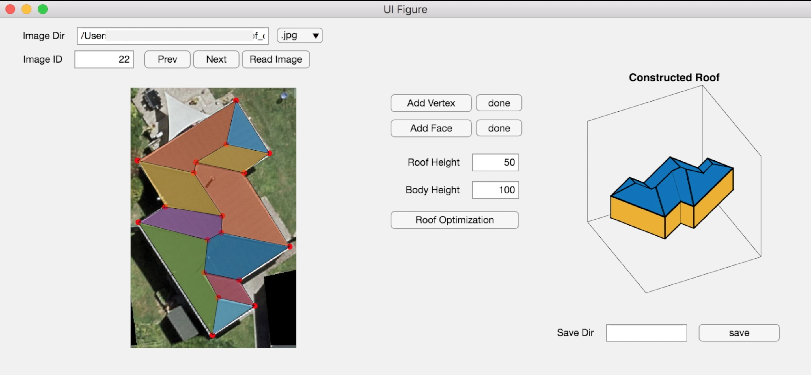
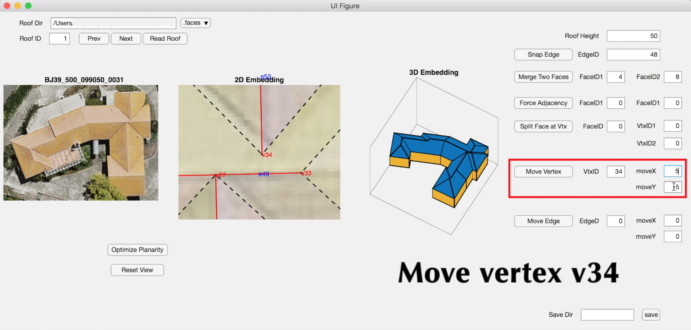

# Matlab User Interfaces for Interactive Editing
We also implemented two Matlab UIs for roof reconstruction and interactive editing. 
## Roof Reconstruction
- See ```ImageReconstruction.mlapp```
- The user first select an image from a folder, then annotate the **primal graph** of the roof on top of the image
- Then press the "Roof Optimization" button, a reconstructed 3D planar roof (building) is shown on the right
- The user can change the roof height and the building height, the building will be udpated accordingly.

<p align="center">
  
</p>

## Interactive Roof Editing
- See ```RoofEditting.mlapp```
- The user can load the image and the pre-computed roof embedding (e.g., from straighted skeleton based methods)
- The user can modify or correct the 2D roof embedding directly, then the 3D embedding will be updated immediately (locally, i.e., only the smallest affected region will be updated)
- Currently, we support the following editing operations:
  - *snap an edge*
  - *move vertex/edge*
  - *merge two faces into a single one*
  - *split a face*
  - *force two faces to be adjacent...*

<p align="center">
  
</p>

## Comments
- The two UIs work well with Matlab 2018b (MacOs), but does not work with Matlab 2019b (windows), sorry if it does not work for you 😂
- If the UIs do not work, perhaps you can check the Matlab script ```test/test_edit.m```, which includes all the important functions/operations that invovle in the UIs.
