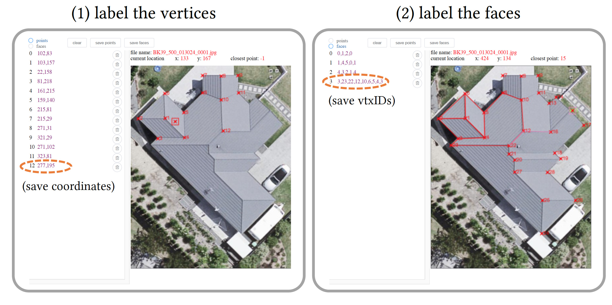
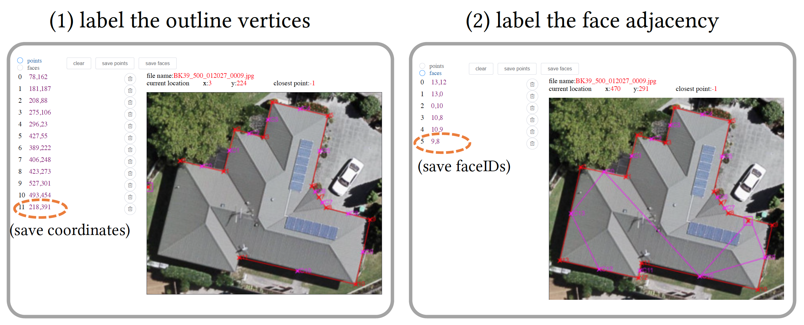

# User Interfaces for Roof Image Annotations
We designed a GUI with two modes to specify the roof topology shown in an input image, from which we can construct a consistent 3D planar roofs.

## Mode 1: annotate the primal roof graph
The user can annotate the **primal graph** of the roof by labeling all the vertices in the roof and then labeling each face by clicking the annotated vertices to form a polygon (i.e., in either clockwise or counter-clockwise order). 

  

## Mode 2: annotate the dual roof graph
The user can label the **dual graph** of the roof. Specifically, the user needs to first annotate the outline vertices in either the clockwise or counter-clockwise order to form an outline polygon. The **center** of the each outline edge is automatically computed afterwards for selection in the next step. Then the user is asked to specify the face adjacency in the dual graph: if two faces are adjacent to each other, the user can simply click the two centers of the outline edges of the corresponding faces. 

  

